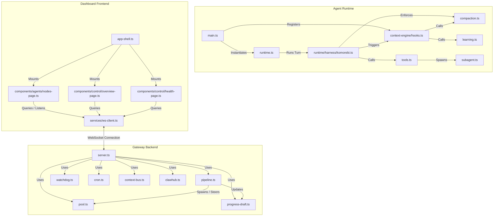

# Codebase Dependency Map & Architectural Alignment Audit

This document traces the internal dependencies, imports, config flows, and SRE hook subscribers across the Komorebi Omoi stack. It cross-references these findings against the architectural specifications to isolate integration contradictions.

---

## 1. Codebase Dependency Graph

---

## 2. Configuration Read/Write Matrix

| Configuration File | Primary Reader(s) | Primary Writer(s) | Role / Purpose |
| :--- | :--- | :--- | :--- |
| `komorebi.config.json` | Gateway (`server.ts`, `cron.ts`), Agent Runtime (`main.ts`), CLI | Config Editor Dashboard Page, CLI | Master system configuration: agents, providers, teams, model definitions. |
| `~/.komorebi/komorebi.json` | Gateway (`server.ts`), CLI | Config Editor Dashboard Page, CLI | User overrides for ports, global auth tokens, and license keys. |
| `~/.komorebi/watchdog-state.json` | Watchdog (`watchdog.ts`) | Watchdog (`watchdog.ts`) | Stores running agent rolling metrics, tool failures, and daily cost tracking. |
| `MEMORY.md` / `memory.md` | Harness (`komorebi.ts`), Prompt Assembler | Compaction (`learning.ts` `runIntelligentFileCompaction`) | Persistent long-term facts compiled dynamically. |
| `AGENTS.md` / `agents.md` | Harness (`komorebi.ts`), Agent Runtime (`runtime.ts`) | Agent Runtime (`runtime.ts`) | Stores the local active agents and teams roster for inter-agent bus routing. |
| `SOUL.md` / `soul.md` | Harness (`komorebi.ts`), Agent Runtime | Dashboard (Config Editor) | Core persona, objectives, and behavioral boundaries. |
| `IDENTITY.md` / `identity.md` | Harness (`komorebi.ts`), Agent Runtime | Dashboard (Config Editor) | Scoped role description and system instructions. |
| `USER.md` / `user.md` | Harness (`komorebi.ts`), Agent Runtime | Dashboard (Config Editor) | User preferences and message brevity rules. |
| `TOOLS.md` / `tools.md` | Harness (`komorebi.ts`), Agent Runtime | Dashboard (Config Editor) | Guide for available capabilities and elevated permission rules. |
| `mood.json` | Agent Runtime (`runtime.ts`) | Agent Runtime (`runtime.ts`) | Telemetry status representing agent mood state and turn stats. |
| `prompt-drift.json` | Agent Runtime (`runtime.ts`) | Agent Runtime (`runtime.ts`) | Tracked meta-cognitive gotcha overrides generated dynamically on tool errors. |
| `skills/performance-histogram.json` | Agent Runtime (`learning.ts`) | Agent Runtime (`learning.ts` `updateSkillPerformance`) | Tracked runs, successes, failures, and confidence score per skill. |
| `skills/usage-log.jsonl` | CEHooks (`CuratorSubscriber`) | CEHooks (`CuratorSubscriber`) | Telemetry log recording tool usage timestamps and success metrics. |
| `learning.log` | CEHooks (`ReflectionSubscriber`) | CEHooks (`ReflectionSubscriber`) | Telemetry logs containing session confidence and error counts. |
| `.history/*` | Agent Runtime (`learning.ts`) | Compaction (`learning.ts` `runIntelligentFileCompaction`) | Compaction backups for the four governed files (last 10 kept). |

---

## 3. SRE Hook Registrations (Plugin Hooks API)

Subscribers are registered in `agent-runtime/src/main.ts` and triggered at execution boundaries inside `agent-runtime/src/runtime/harness/komorebi.ts` and `agent-runtime/src/runtime.ts`.

| Subscriber Name | Hook Subscribed | Action Performed |
| :--- | :--- | :--- |
| **`SkillsLoaderSubscriber`** | `onBeforeAgentRun` | Inject active playbooks (Level-1) and reference files (Level-2) into the prompt context via text similarity. |
| **`ReflectionSubscriber`** | `onAgentRunComplete` | Analyzes results, appends to `learning.log`, updates the skill performance histogram, and spawns background skill extraction. |
| **`CompactionSubscriber`** | `onCompactionTriggered` | Triggers sequential staged compaction to prune session history size under limits. |
| **`CuratorSubscriber`** | `onAgentRunComplete` | Logs tool call performance metrics to `usage-log.jsonl`. |
| **`ProgressDraftSubscriber`** | `onBeforeAgentRun`, `onAgentRunComplete` | Logs message ingestion and reply draft states to standard output. |
| **`WatchdogSubscriber`** | `onAfterToolCall`, `onAgentRunComplete` | Logs registered tool calls and final token counts to standard output. |
| **`ProactivitySubscriber`** | `onToolCall` | Logs tool execution classification details. |

---

## 4. Architectural Alignment Audit & Contradiction Flags

### 🚩 Contradiction A: Reflection Subscriber Dynamic Import Failure
*   **Documentation Design**: `CONTEXT-ENGINE.md` and `PRODUCTION-READINESS-REPORT.md` specify that the Reflection Subscriber successfully records skill outcomes to the performance histogram without exceptions.
*   **Actual Wiring**: `ReflectionSubscriber` dynamically imports `updateSkillPerformance` using `const { updateSkillPerformance } = await import("../learning.js")`. This dynamic import returns `undefined` (not a function) in the Node.js ESM runtime due to execution context caching, throwing a loud runtime exception on every successful or failed turn.
*   **Suspected Root Cause**: Cyclic dependency or ESM import resolver caching issue inside the transpiled dynamic module loader. Needs static import conversion.

### 🚩 Contradiction B: Simulated Pipeline Node Statuses
*   **Documentation Design**: Requirement specifies that every page on the Dashboard must pull live data via WebSocket subscriptions, removing all mocked/stale telemetry.
*   **Actual Wiring**: `NodesPage` (`nodes-page.ts`) defines an interval that randomly alters step statuses (`completed`, `active`, `idle`) and latency values every 5 seconds. It does not subscribe to the active event bus or WebSocket progress events.
*   **Suspected Root Cause**: Gaps in dashboard subscription to the `"loop_progress"` topic.

### 🚩 Contradiction C: Dashboard HTTP REST Callbacks
*   **Documentation Design**: Dashboard must use live WS subscriptions/RPC calls exclusively.
*   **Actual Wiring**: Multiple pages (Overview, Health, Instances, Config Editor) make standard REST `fetch()` calls to HTTP endpoints rather than leveraging the active `WsClient` socket loop.
*   **Suspected Root Cause**: WS RPC handlers do not support all system administration and telemetry retrieval methods.
