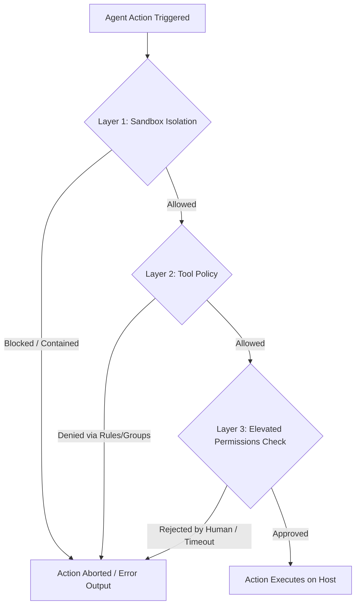

# Komorebi Omoi - Three-Layer Security Model

Komorebi Omoi implements a robust, multi-layered security architecture designed to prevent unauthorized code execution, prompt injections, and host environment compromise.

The model is composed of three **independent, composable layers**. For any high-risk action to succeed, all three layers must independently approve the execution. A vulnerability or misconfiguration in one layer will not compromise the security of the host system.

---

## The Three Layers

### 1. Sandbox Layer (Containment)
- **Purpose**: Restricts the process-level blast radius.
- **Mechanism**: Each of the 10 concurrent agent instances runs in its own isolated OS child process. On Linux hosts, process-level namespaces (e.g. via `bubblewrap`) or lightweight Docker containers jail the runtime workspace, limiting access to directories outside the agent's folder (`~/.komorebi/agents/<agentId>/`).
- **Policy**: Sandbox properties are defined globally or per-agent, isolating the filesystem, network devices, and process trees.

### 2. Tool Policy Layer (Gating Rules)
- **Purpose**: Restricts what capability APIs are available for the agent to invoke.
- **Mechanism**: Enforces Zod-validated allowlists and denylists inside `agent.config.json`.
- **Precedence ("Deny Always Wins")**: If a tool name or group name matches both an allow rule and a deny rule, **deny always takes precedence**.
- **Tool Groups**: Rather than configuring tools individually, tools are organized into named groups for easy management:
  - `filesystem`: `["read_file", "write_file", "edit_file", "delete_file"]`
  - `network`: `["web_search", "web_fetch", "generic_api_call"]`
  - `bus`: `["agent_message"]`
  - `destructive`: `["exec", "delete_file"]`

### 3. Elevated Permission Layer (Human-in-the-Loop)
- **Purpose**: Adds an interactive confirmation checkpoint for high-risk actions.
- **Mechanism**: Specific actions (e.g., executing commands with `sudo`, deleting files outside the immediate workspace, or sending Telegram messages to non-allowlisted chat IDs) trigger an out-of-band human approval request.
- **Timeout**: The approval request is dispatched to the user (via Telegram inline button cards or WebChat prompts) and pauses execution for up to 120 seconds. If no approval is received within 120s, the request times out and defaults to **deny**.

---

## Integrity Principles
- **No Direct SHARED Writes**: Agents are strictly forbidden from writing directly to `SHARED/SIGNALS.md` and `SHARED/FEEDBACK-LOG.md`. All writes must route through the `agent_message` tool using targeted intents, ensuring concurrent writes are synchronized under atomic file locks.
- **No Secret Leakage**: Under no circumstances should agent runtimes output tokens, session keys, or API credentials. All credentials must reference configuration parameters (e.g., `agent.config.json.tools.<name>`) rather than raw values.
